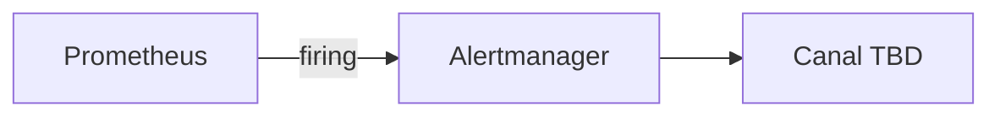

# Flujo de alertas

**Estado:** BLOQUEADO

## Evidencia

- Reglas Prometheus: **NO ENCONTRADO** en Git
- Alertmanager receivers/routes: **NO ENCONTRADO** en Git
- Canales (email, Telegram, etc.): **NO VERIFICADO**

