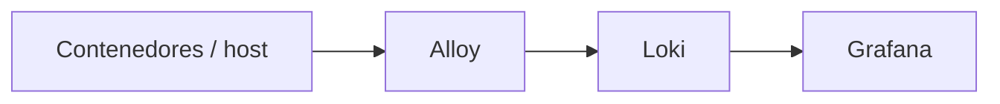

# Flujo de logs

**Estado:** BLOQUEADO

Componentes citados: Alloy, Loki, Grafana.

## Evidencia en Git

**NO ENCONTRADO:** configs Alloy/Loki, pipelines, labels.

Ver: [../logging/README.md](../logging/README.md)
