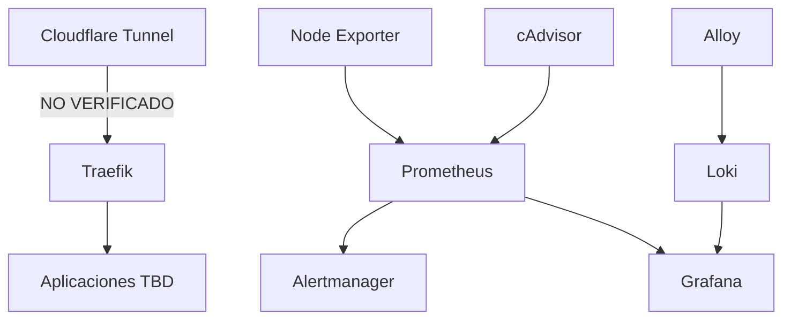

# Arquitectura lógica

**Estado:** NO VERIFICADO (plantilla del briefing)

El siguiente diagrama refleja **únicamente** los componentes citados en el briefing de inventario. No implica que estén desplegados ni conectados así.

## Dependencias verificadas

Ninguna. En Git no hay compose ni labels Traefik.

## Acción

Sustituir este diagrama tras `docker inspect` + lectura de compose reales.
