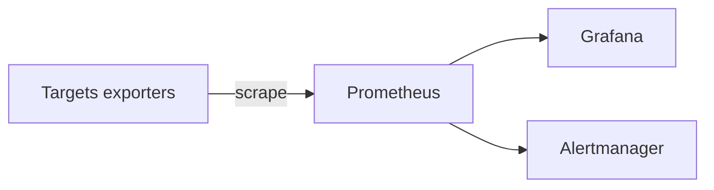

# Flujo de monitorización

**Estado:** BLOQUEADO

Componentes citados en briefing: Prometheus, Node Exporter, cAdvisor, Grafana, Alertmanager.

## Evidencia en Git

**NO ENCONTRADO:** `prometheus.yml`, scrape configs, reglas, datasources Grafana.

## Diagrama a validar

Ver también: [../monitoring/README.md](../monitoring/README.md)
