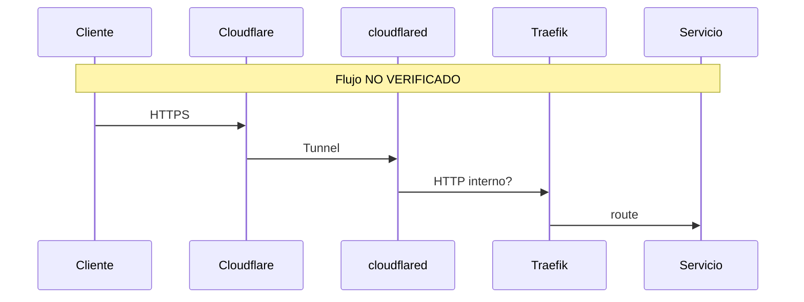

# Flujo de red

**Estado:** BLOQUEADO

## Preguntas abiertas (sin evidencia)

- ¿Qué redes Docker existen y cómo se segmentan?
- ¿Traefik escucha en qué entrypoints / puertos?
- ¿cloudflared termina TLS y reenvía a Traefik o a servicios?
- ¿Hay exposición directa de puertos en el host (`ss -tulpn`)?
- ¿Hay firewall (ufw/nftables/iptables)?

## Diagrama objetivo a completar

Referencias futuras: [../networking/README.md](../networking/README.md)
