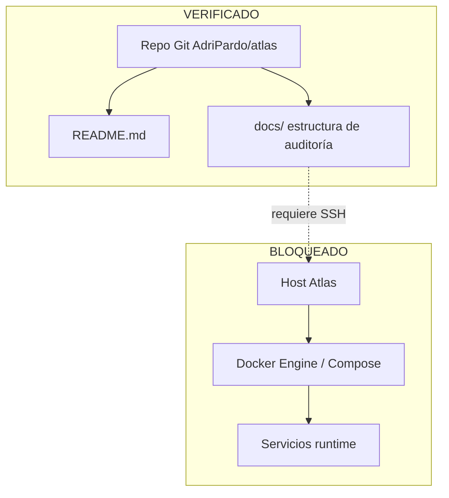

# Visión de arquitectura

## Objetivos declarados (briefing — NO VERIFICADO en host)

Atlas se define como plataforma de infraestructura self-hosted para:

- desarrollo
- despliegue
- observabilidad
- automatización
- monitorización
- operación de aplicaciones

No se trata de un homelab informal: el diseño debe soportar crecimiento plurianual sin reescrituras mayores.

## Estado verificado hoy

## Capas objetivo (declaradas — NO VERIFICADO)

Hasta disponer de evidencia del host, estas capas son **hipótesis de diseño del briefing**, no arquitectura observada:

1. **Edge / acceso**: Cloudflare Tunnel → Traefik
2. **Observabilidad métricas**: Node Exporter / cAdvisor → Prometheus → Alertmanager / Grafana
3. **Observabilidad logs**: Alloy → Loki → Grafana
4. **Persistencia y backups**: volúmenes Docker + procedimientos (sin evidencia)

Cuando exista recolección, este documento se reescribirá con rutas, compose y redes reales.
