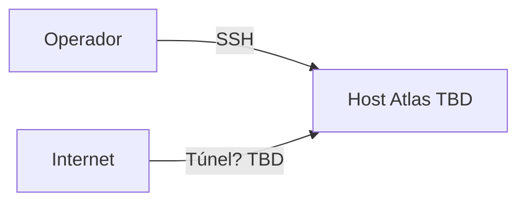

# Arquitectura física

**Estado:** BLOQUEADO

## Evidencia requerida

| Dato | Fuente esperada | Estado |
| --- | --- | --- |
| Hostname / FQDN | `hostname`, DNS | BLOQUEADO |
| Proveedor / bare metal / VM | inventario host | BLOQUEADO |
| CPU / RAM / disco | `lscpu`, `free`, `df` | BLOQUEADO |
| Interfaces de red / IPs | `ip -br a` | BLOQUEADO |
| Ubicación de datos | mounts, volúmenes Docker | BLOQUEADO |
| Sistema operativo | `/etc/os-release` | BLOQUEADO |

## Diagrama

No se dibuja un diagrama físico inventado. Tras la recolección:

Actualizar con datos de `inventory/raw/host/`.
